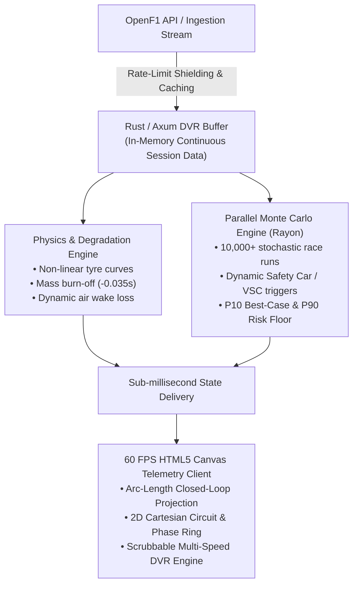

# 🏎️ F1 Strategy Engine: Real-Time Formula 1 Digital Twin & Pit Wall Optimizer

[](https://www.rust-lang.org/)
[](https://github.com/tokio-rs/axum)
[](https://github.com/rayon-rs/rayon)
[](https://swagger.io/)
[](https://opensource.org/licenses/MIT)
[](https://github.com/dbl04/f1_strategy_engine/actions)

A mission-critical, high-performance Formula 1 race strategy digital twin and real-time telemetry playback engine built in **Rust** and **Axum**. The engine combines non-linear physics modeling, dynamic programming for pit window solving, and parallelized Monte Carlo simulations to quantify tactical decision risks in real-time.

Telemetry ingestion is decoupled and rate-shielded from the OpenF1 REST API, serving an interactive 60 FPS zero-dependency McLaren ATLAS-inspired dashboard with scrubbable DVR capabilities.

---

## ⚡ Key Architectural Highlights



### 1. Stochastic Strategy Optimization (Rayon Concurrency)
* **10,000+ Parallel Permutations:** Leverages CPU data-parallelism via `rayon` to compute high-throughput Monte Carlo race simulations in under 100ms.
* **Safety Car & VSC Disruption:** Injects circuit-specific historical neutralisation probabilities (e.g., Monaco 80%, Monza 25%) to dynamically identify pit windows where delta time loss drops by ~40%.
* **Risk Floor Metrics:** Quantifies strategic variance by generating Expected Mean Race Times alongside **P10 Best-Case** and **P90 Risk Floor** confidence intervals.

### 2. High-Fidelity Non-Linear Physics Engine (`src/engine/physics.rs`)
* **Pirelli Thermal & Wear Curves:** Models distinct compounds (Soft, Medium, Hard, Intermediate, Wet) with exponential wear progression and cliff degradation thresholds.
* **Mass Fuel Burn-Off:** Evaluates delta lap gain dynamically derived from vehicle weight reduction (-0.035s per lap as fuel burns off).
* **Environmental & Aero Wake Penalties:** Dynamically penalizes downforce deltas in dirty air regimes, track surface temperature fluctuations, and wing damage offsets.

### 3. Decoupled Ingestion & Rate-Limit Shielding (`src/api/openf1.rs`)
* **Unified State Snapshots:** Aggregates multi-endpoint OpenF1 telemetry streams (driver positions, interval gaps, stint histories, weather, and race control flags) into a single `/api/live-state/:session_key` response.
* **Zero-Allocation Serialization:** Powered by `serde` and `axum` for sub-millisecond serialization latencies.
* **Resilient Fallback Generators:** Ships with synthetic 22-car, 53-lap deterministic session generators for offline development and testing.

### 4. Telemetry Dashboard & In-Memory DVR Player
* **Arc-Length Track Normalization:** Projects raw Cartesian telemetry data onto closed-loop circuit geometries:
  $$\theta = 2\pi \left(\frac{d}{D_{\text{total}}}\right) - \frac{\pi}{2}$$
* **Dual Visualization:** Seamlessly toggle between a spatial 2D Track Map and a normalized 360° Circular Relative Position Radar.
* **Scrubbable DVR Ticker:** Decoupled in-memory playback supporting 1x, 2x, 5x, and 10x scrubbing with sub-frame linear interpolation (LERP).

---

## 🛠️ Tech Stack

| Domain | Technology |
| :--- | :--- |
| **Language** | Rust (2024 Edition) |
| **Backend & Async** | Axum 0.7, Tokio, Reqwest |
| **Parallel Computing**| Rayon (Multithreaded Data Parallelism) |
| **Serialization** | Serde JSON (Zero-Allocation Parsing) |
| **API Specification** | OpenAPI 3.0 via Utoipa & Swagger UI |
| **Frontend UI** | Vanilla JavaScript, HTML5 Canvas API (No framework overhead, 60 FPS) |
| **Data Ingestion** | OpenF1 REST API, OpenStreetMap Overpass API |

---

## 📂 Project Directory Structure

```text
├── assets/
│   ├── index.html         # McLaren ATLAS-inspired 60 FPS Telemetry Dashboard
│   └── js/                # Canvas render loop, DVR state machine, LERP engine
├── src/
│   ├── api/
│   │   ├── mod.rs         # Route bindings & handlers
│   │   └── openf1.rs      # Telemetry ingestion, caching, and rate shielding
│   ├── engine/
│   │   ├── mod.rs         # Engine modules export
│   │   ├── monte_carlo.rs # Rayon-powered 10,000-run stochastic simulator
│   │   ├── optimizer.rs   # Multi-stop dynamic programming pit window solver
│   │   └── physics.rs     # Tyre degradation curves & dynamic fuel burn-off
│   └── main.rs            # Axum server initialization and graceful shutdown
├── Cargo.toml             # Rust dependencies and release profiles
└── README.md
```

---

## 🚀 Quickstart

### Prerequisites
* [Rust Toolchain (Cargo)](https://rustup.rs/) (v1.75+)

### Installation & Execution
```bash
# 1. Clone the repository
git clone https://github.com/dbl04/f1_strategy_engine.git
cd f1_strategy_engine

# 2. Build and run backend server in release mode (for maximum compiler optimization)
cargo run --release

# 3. Access the Dashboard
# The Axum server binds by default to port 3000
open http://localhost:3000

# 4. Interactive OpenAPI / Swagger Documentation
open http://localhost:3000/swagger-ui
```

---

## ⚖️ License
Distributed under the MIT License. See `LICENSE` for more information.